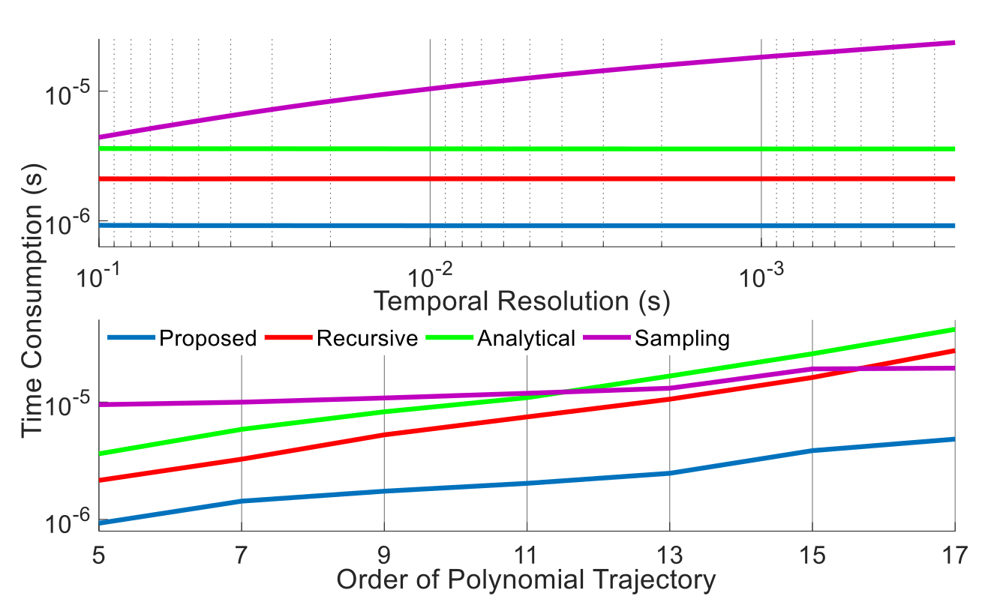
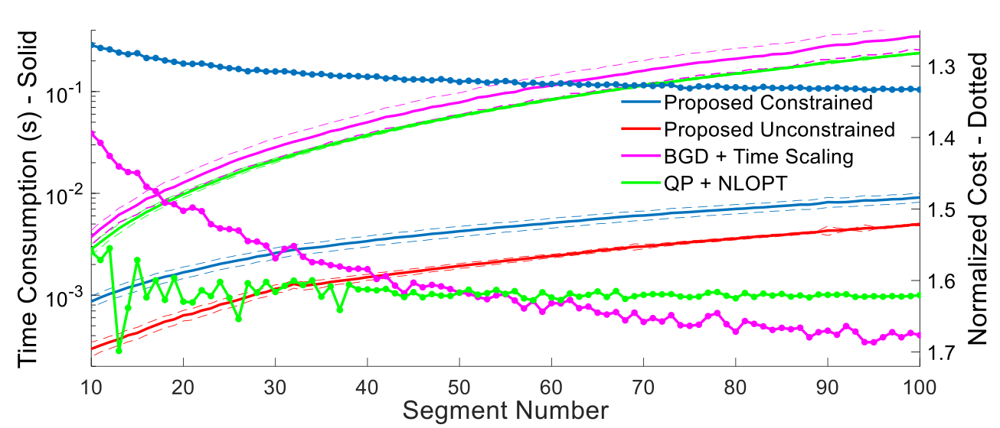
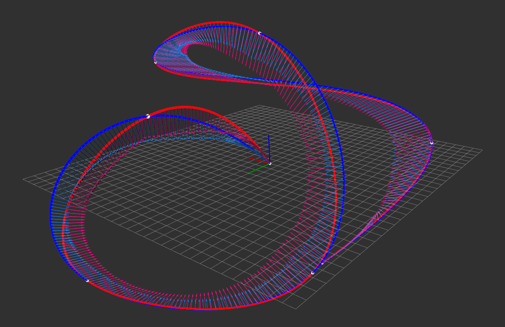
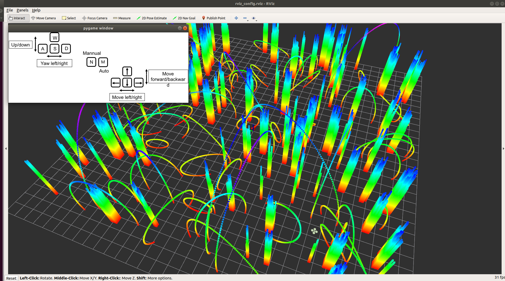
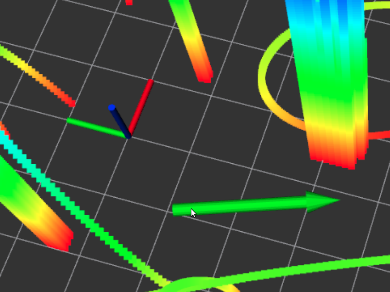
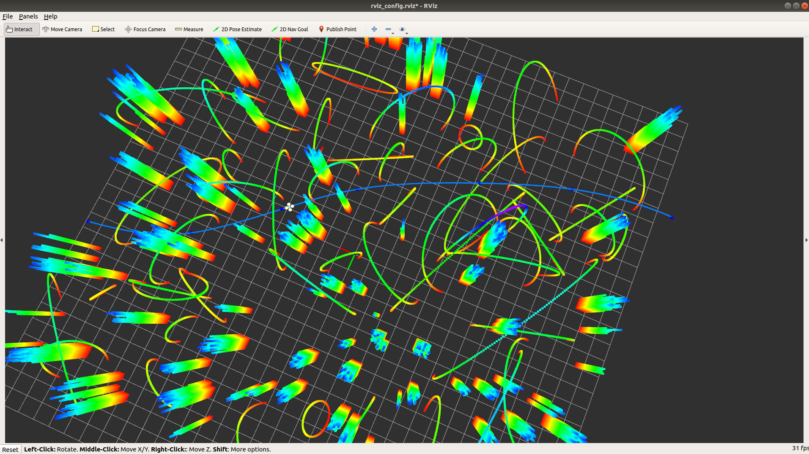

# AM-Traj

Alternating Minimization Based Trajectory Generation for Quadrotor Aggressive Flight
基于交替最小化的四旋翼攻击飞行轨迹生成

# Deprecated !!!

This repo is deprecated.

For __local-planning__, it is encouraged to use our [__EGO-Planner__](https://github.com/ZJU-FAST-Lab/ego-planner). 

For __general-purpose multicopter trajectory optimization__, it is encouraged to check our solver [__GCOPTER__](https://github.com/ZJU-FAST-Lab/GCOPTER) if released.

## 0. About

__AM-Traj__ is a __C++11__ [__header-only__](https://en.wikipedia.org/wiki/Header-only) library for generating large-scale piecewise polynomial trajectories for aggressive autonomous flights, with highlights on its superior computational efficiency and simultaneous spatial-temporal optimality. Besides, an extremely fast feasibility checker is designed for various kinds of constraints. All components in this framework leverage the algebraic convenience of polynomial trajectory optimization problem, thus our method is capable of computing a spatial-temporal optimal trajectory with 60 pieces within 5ms, i.e., 150Hz at least. You just need to include "am_traj.hpp" and "root_finder.hpp" in your code. __Please use the up-to-date master branch which may have a better performance than the one in our paper.__
__AM-Traj__ 是一个用于生成攻击性自主飞行的大规模分段多项式轨迹的库，突出了其卓越的计算效率和同时的时空优化。此外，还为各种约束条件设计了一个非常快速的可行性检查器。该框架中的所有组件都利用了多项式轨迹优化问题的代数便利性，因此我们的方法能够在5ms内（即，至少150Hz）计算60个片段的时空最优轨迹。您只需要在代码中包含“am_traj.hpp”和“root_finder.hpp”__请使用最新的主分支，它可能比我们论文中的分支性能更好__

__Author__: [Zhepei Wang](https://zhepeiwang.github.io/) and [Fei Gao](https://ustfei.com/) from the [ZJU Fast Lab](http://zju-fast.com/).

__Related Papers__:

- [__Alternating Minimization Based Trajectory Generation for Quadrotor Aggressive Flight__](https://ieeexplore.ieee.org/document/9121729), Zhepei Wang, Xin Zhou, Chao Xu, Jian Chu, and Fei Gao, IEEE Robotics and Automation Letters (RA-L).
- [__Detailed Proofs of Alternating Minimization Based Trajectory Generation for Quadrotor Aggressive Flight__](https://arxiv.org/abs/2002.09254), Zhepei Wang, Xin Zhou, Chao Xu, and Fei Gao, the supplementary material.

  If you use our code for your academic research, please cite the first related paper.
  如果您使用我们的代码进行学术研究，请引用第一篇相关论文。 

__Video Links__: [youtube](https://youtu.be/H89ALyWA2NI) or [bilibili](https://www.bilibili.com/video/av91537651)

  

  
  

## 1. Features

- Only two headers are required for usage. The first one is "am_traj.hpp", which contains a polynomial trajectory optimizer. The second one is "root_finder.hpp", which originates from a self-developed [toolkit](https://github.com/ZJU-FAST-Lab/Root-Finder).

使用时只需要两个标头。第一个是“am_traj.hpp”，它包含一个多项式轨迹优化器。第二个是“root_finder.hpp”，它源于一个自主开发的 [toolkit]

- No complex third-party dependencies except [STL](https://en.wikipedia.org/wiki/Standard_Template_Library) and [Eigen](https://en.wikipedia.org/wiki/Eigen_(C%2B%2B_library)).

- The library is able to generate __large-scale__ trajectories with __optimal coefficients__ and __optimal time allocations__ in __real-time__, without using general purpose [NLP](https://en.wikipedia.org/wiki/Nonlinear_programming) solvers. Both the unconstrained case as well as the constrained case are considered.
该库能够在不使用通用[NLP]的情况下，实时生成具有最佳系数和最佳时间分配的大规模轨迹解决方案。(https://en.wikipedia.org/wiki/Nonlinear_programming)同时考虑了无约束情况和约束情况。

- The library provides an efficient formulation for various feasibility checkers. Only algebraic operations are involved, which make our feasbility check for some high-order (>4) constraints even __faster than traditional check by closed-form solutions__ for low-order constraints (<=4). Therefore, the scalability makes it no longer painful to do feasibility check for high-order polynomial trajectories.
-该库为各种可行性检查提供了有效的公式。只涉及代数运算，这使得我们对某些高阶（>4）约束的可行性检查比对低阶约束（<=4）的传统闭式解检查更快。因此，可扩展性使得对高阶多项式轨迹进行可行性检查不再困难。 

- The library implements an extremely fast spatial trajectory solver when time allocation is prefixed and constraints are not considered. It uses a Banded LU Factorization which is much more efficient here than a general Sparse LU Factorization. The former has linear time complexity while the latter may get stuck in its "analyzePattern". Therefore, our lib __only requires 4 (or 18) seconds__ to generate an __Unconstrained Spatial (or Spatial-Temporal) Optimal Traj with 1000000 Segments__!!!
-当时间分配被预先设定并且不考虑约束时，该库实现了一个非常快速的空间轨迹解算器。它使用带状LU因子分解，这比一般稀疏LU因子分解更有效。前者具有线性时间复杂性，而后者可能陷入“分析模式”。因此，我们的库只需要4（或18）秒就可以生成具有1000000个分段的无约束空间（或空间-时间）最优轨迹！！！ 

## 2. Interface

Only three functions below are needed.
只需要以下三个功能.

### __Constructor__

  AmTraj(double wT, double wA, double wJ, double mVr, double mAr, int mIts, double eps)

  Inputs:

    wT: Weight for the time regularization
    wA: Weight for the integrated squared norm of acceleration
    wJ: Weight for the integrated squared norm of jerk
    mVr: Maximum velocity rate
    mAr: Maximum acceleration rate
    mIts: Maximum number of iterations in optimization
    eps: Relative tolerance

  输入:

    wT：时间正则化的权重
    wA：加速度积分平方范数的权重
    wJ：加加速度综合平方范数的权重
    mVr：最大流速
    mAr：最大加速率
    mIts：优化中的最大迭代次数
    eps：相对公差 

  Outputs:

    An instance of AmTraj: An object used for trajectory generation
  
  输出:

    AmTraj的一个实例：用于轨迹生成的对象(即构造一个生成轨迹的对象，运行加载时即初始化成功)

  Example:

    AmTraj amTrajOpt(1024.0, 32.0, 1.0, 7.0, 3.5, 32, 0.02);

### __Unconstrained Spatial-Temporal Optimization__
### __无约束时空优化__

    Trajectory AmTraj::genOptimalTrajDT(const std::vector<Eigen::Vector3d> &wayPs, Eigen::Vector3d iniVel, Eigen::Vector3d iniAcc, Eigen::Vector3d finVel, Eigen::Vector3d finAcc) const

  Inputs:

    wayPs: Fixed waypoints for a trajectory
    iniVel: Trajectory velocity at the first waypoint
    iniAcc: Trajectory acceleration at the first waypoint
    finVel: Trajectory velocity at the last waypoint
    finAcc: Trajectory acceleration at the last waypoint

  输入:

    wayPs：轨迹的固定航路点
    iniVel：第一个航路点的轨迹速度
    iniAcc：第一个航路点的轨迹加速度
    finVel：最后一个航路点的轨迹速度
    finAcc：最后一个航路点的轨迹加速度 

  Outputs:

    An instance of Trajectory: A trajectory with optimal coefficient matrices and optimal durations, on which constraints of maximum velocity/acceleration rate are not guaranteed

  输出:
    轨迹的一个例子：具有最佳系数矩阵和最佳持续时间的轨迹，其上的最大速度/加速率的约束是不保证的
  
  Example:

    Eigen::Vector3d iV(2.0, 1.0, 0.0), fV(0.0, 0.0, 0.0)
    Eigen::Vector3d iA(0.0, 0.0, 2.0), fA(0.0, 0.0, 0.0)
    std::vector<Eigen::Vector3d> wPs;
    wPs.emplace_back(0.0, 0.0, 0.0);
    wPs.emplace_back(4.0, 2.0, 1.0);
    wPs.emplace_back(9.0, 7.0, 5.0);
    wPs.emplace_back(1.0, 3.0, 2.0);
    Trajectory traj = amTrajOpt.genOptimalTrajDT(wPs, iV, iA, fV, fA);

### __Constrained Spatial-Temporal Optimization__
### __约束时空优化__ 

    Trajectory AmTraj::genOptimalTrajDTC(const std::vector<Eigen::Vector3d> &wayPs, Eigen::Vector3d iniVel, Eigen::Vector3d iniAcc, Eigen::Vector3d finVel, Eigen::Vector3d finAcc) const

  Inputs:

    wayPs: Fixed waypoints for a trajectory
    iniVel: Trajectory velocity at the first waypoint
    iniAcc: Trajectory acceleration at the first waypoint
    finVel: Trajectory velocity at the last waypoint
    finAcc: Trajectory acceleration at the last waypoint

  输入:
    wayPs：轨迹的固定航路点
    iniVel：第一个航路点的轨迹速度
    iniAcc：第一个航路点的轨迹加速度
    finVel：最后一个航路点的轨迹速度
    finAcc：最后一个航路点的轨迹加速度

  Outputs:

    An instance of Trajectory: A trajectory with optimal coefficient matrices and best time allocation, whose maximum velocity/acceleration rate are guaranteed to satisfy constraints

  输出:

    轨迹的一个例子：具有最佳系数矩阵和最佳时间分配的轨迹，其最大速度/加速度保证满足约束 
  
  Example:

    Eigen::Vector3d iV(2.0, 1.0, 0.0), fV(0.0, 0.0, 0.0)
    Eigen::Vector3d iA(0.0, 0.0, 2.0), fA(0.0, 0.0, 0.0)
    std::vector<Eigen::Vector3d> wPs;
    wPs.emplace_back(0.0, 0.0, 0.0);
    wPs.emplace_back(4.0, 2.0, 1.0);
    wPs.emplace_back(9.0, 7.0, 5.0);
    wPs.emplace_back(1.0, 3.0, 2.0);
    Trajectory traj = amTrajOpt.genOptimalTrajDTC(wPs, iV, iA, fV, fA);

### __The Others__

  There are many useful functions in the header files. Use it by following their comments.

## 3. Performance

### 3.0 Performance over different feasibility checkers

  

We compare our feasibility check method with [Mueller's recursive bound check](https://doi.org/10.1109/TRO.2015.2479878), [Burri's analytical extrema check](https://doi.org/10.1109/IROS.2015.7353622), as well as the widely used sampling-based check. In each case, 1000 trajectory pieces are randomly generated along with maximum velocity rate constraints to estimate average time consumption. As is shown in above figure, our method outperforms all other methods in computation speed because of its resolution independence and scalability with higher polynomial orders. 

我们将我们的可行性检查方法与[Mueller的递归边界检查]进行了比较(https://doi.org/10.1109/TRO.2015.2479878)，[Burri的分析极值检查](https://doi.org/10.1109/IROS.2015.7353622)以及广泛使用的基于抽样的检查。在每种情况下，随机生成1000个轨迹片段以及最大速度率约束，以估计平均时间消耗。如上图所示，我们的方法在计算速度上优于所有其他方法，因为它具有较高的多项式阶数的分辨率独立性和可扩展性。 

### 3.1 Performance over different trajectory optimizers

  

The benchmark is done as follows: We generate a sequence of waypoints by random walk, of which the step is uniformly distributed over [-3.0m, 8.0m] for each axis. The maximum speed and acceleration rates are set to 5.0m/s and 3.5m/s^2, respectively. The derivatives on the first and the last waypoints are set to zero. The objective function is set as wT=512.0, wA=0.0, wJ=1.0. For a given number of pieces, each method is applied to 1000 sequences of waypoints. The cost is then normalized by the cost of unconstrained case of our method. All comparisons are conducted on an Intel Core i7-8700 CPU under Linux environment.

基准测试如下所示：我们通过随机行走生成路线点序列，其中每个轴的步长均匀分布在[3-3.0m，8.0m]上。最大速度和加速度分别设置为5.0m/s和3.5m/s^2。第一个和最后一个航路点上的导数设置为零。目标函数设置为wT=512.0，wA=0.0，wJ=1.0。对于给定数量的工件，每种方法适用于1000个航路点序列。然后通过我们的方法的无约束情况的成本对成本进行归一化。所有比较都是在Linux环境下的Intel Core i7-8700 CPU上进行的。 

We compare our method with [Richter's method](https://doi.org/10.1177/0278364914558129) with time allocation optimized by [NLopt](https://nlopt.readthedocs.io/en/latest/) (QP + NLOPT) and [Mellinger's method](https://doi.org/10.1109/ICRA.2011.5980409) with durations properly scaled using [Liu's method](https://ieeexplore.ieee.org/document/7839930/) (BGD + Time Scaling). As is shown in the figure above, our optimizer has the fastest speed and the lowest cost when constraints are taken into consideration.

我们将我们的方法与[里希特方法]进行比较(https://doi.org/10.1177/0278364914558129)通过[NLopt]优化时间分配(https://nlopt.readthedocs.io/en/latest/)（QP+NLOPT）和[Mmellinger方法](https://doi.org/10.1109/ICRA.2011.5980409)使用[刘的方法]适当调整持续时间(https://ieeexplore.ieee.org/document/7839930/)（BGD+时间缩放）。如上图所示，当考虑到约束时，我们的优化器具有最快的速度和最低的成本。 
## 4. Examples

Two examples are provided in this repository.

### 4.0 Example 0

  Example 0 contains a simple comparison between the constrained case of our method against conventional method which uses heuristic time allocation along with time scaling. The lap time, maximum velocity/acceleration rate, cost function value, and visualization are provided.

  示例0包含了我们的方法的约束情况与使用启发式时间分配和时间缩放的传统方法之间的简单比较。提供了圈时间、最大速度/加速率、成本函数值和可视化。 

  

- Building

  To build this example, first make sure you have [ROS](http://wiki.ros.org/melodic/Installation/Ubuntu) properly installed. Desktop-full install is recommended. Second, clone this repository into the __src__ directory of your ROS workspace. Rename it am_traj then __move the example1 subdirectory to somewhere else__, because we only consider the building of example0 here. Use the following command to install Eigen if they are not ready.
  
      sudo apt install libeigen3-dev
  
  Now cd into your current ROS workspace

      catkin_make

- Running

      source devel/setup.bash
      rospack profile
      roslaunch example0 example0.launch

  Now you can see the example 0 is running with visualization showing in rviz.

- Parameters Setting

  It is strongly recommended that modifying parameters after roughly going through our related papers. The parameters for objective should satisfy the corresponding assumption. For example, zero weight for time is illegal. Although our method is quite efficient when initial guess is far from optimum, it is still a first-order method with no Hessian info leveraged. Technically speaking, the best convergence rate for first-order method under smooth nonconvex consumption is sublinear, which means higher precision requires much more iterations. Therefore, we suggest that the relative tol should be set as 0.02~0.001. Pratically, time allocations [1.00, 2.00, 4.00, 0.30] and [1.01, 2.02, 4.04, 0.303] won't make much difference for real-time usage.
    
  强烈建议在粗略阅读相关论文后修改参数。目标参数应满足相应的假设。例如，时间的零权重是非法的。虽然我们的方法在初始猜测远未达到最优时非常有效，但它仍然是一个一阶方法，没有利用黑森信息。从技术上讲，在光滑非凸消耗下，一阶方法的最佳收敛速度是次线性的，这意味着更高的精度需要更多的迭代。因此，我们建议将相对tol设置为0.02~0.001。实际上，时间分配[1.00、2.00、4.00、0.30]和[1.01、2.02、4.04、0.30]对实时使用不会产生太大的影响。  
### 4.1 Example 1

  Example 1 contains a complete global planner simulation procedure. In this example, we adopt an RRT* based waypoints selector proposed by [Richter et al.](https://doi.org/10.1177/0278364914558129). Based on the selector, we use our library to generate a optimal feasible trajectory. The whole planner is able to do global traejctory generation in real time.

  

- Building

  To build this example, first make sure you have ROS and Eigen properly installed as described in previous example. Moreover, some parts of the simulation require GCC 7. Therefore, if your GCC version is below the required version, the following commands help you install it without changing your default compiler.
  
      sudo apt-get install -y gcc-7 g++-7 && sleep 0.2;
      sudo update-alternatives --install /usr/bin/gcc gcc /usr/bin/gcc-5 60 --slave /usr/bin/g++ g++ /usr/bin/g++-5 && sleep 0.2;
      sudo update-alternatives --install /usr/bin/gcc gcc /usr/bin/gcc-7 50 --slave /usr/bin/g++ g++ /usr/bin/g++-7;
  
  Second, use the following commands to install [PyGame](https://www.pygame.org/) and [OMPL](https://ompl.kavrakilab.org/).

      sudo apt install python-pygame
      cd ~/Desktop/
      wget https://github.com/ompl/ompl/archive/1.4.2.zip        //https://github.com/ompl/ompl/releases
      unzip 1.4.2.zip
      cd ompl-1.4.2
      mkdir build
      cd build
      cmake ..
      make
      sudo make install
  
  Third, clone this repository into the __src__ directory of your ROS workspace. Rename it am_traj. Now cd into your current ROS workspace.

      catkin_make

- Running
  
  Type following commands to start all nodes first.

      source devel/setup.bash
      rospack profile
      roslaunch example1 example1.launch
  
  Open a new terminal in your current ROS workspace and then

      source devel/setup.bash
      python src/am_traj/example1/key2joy.py

  Now you can see an rviz window and a pygame window, which are shown below.

  

  First, we should keep the pygame window active by click it once. Then, press N on your keyboard to activate manual mode. Press W/A/S/D and Up/Down/Left/Right on your keyboard to control the white quadrotor's height/yaw and horizontal movement respectively. Please navigate the quadrotor to a safe region. After that, press M on your keyboary to enter auto mode such that global planner is activated.

  To navigate the quadrotor to any region safely, you should click once the following button on tools bar of rviz.

  

  Once the button is clicked, you can move your mouse arrow to any free region you want. Click the place and hold it, then a green arrow appears as is shown in the following figure. You can change the direction of the green arrow. It is worth noting that, the angle between this arrow and positive part of x-axis (red axis) decides the relative height you want the quadrotor to keep at this region. The arrow in figure below gives 60 degrees which means the desired height is 60/180*MapHeight.

  

  Now unhold the click, the global planner will finds you an appropriate trajectory instantly. The quadrotor then tracks the trajectory.

  

- Conclusion

  In most cases, the planner in this example is far faster than sampling-based kinodynamic planner, which may take several seconds to find an relative good trajectory for quadrotors. However, the RRT* used for waypoints selection can still take a relative long time (0.05 ~ 0.10 s) in comparison with our trajectory optimizer (about 0.5 ms for unconstrained case and 2.0 ms for constrained case). What's more, the waypoint selector does not consider the dynamics. That's to say, it is possible that wierd waypoints may be selected, when initial speed is large or obstacles are too dense. We claim that this is the __inherent property__ of the adopted waypoint selector.

## 5. Misc

- The library implements a specific order of polynomial trajectory optimization. If higher or lower order is required, it is recommended to refer to our related papers, where the framework used in the library are described and analyzed more flexibly.

- The self-developed toolkit "root_finder.hpp" used in this library is an portable substitution to the suggested modern univariate polynomial real-roots solver in our related paper. It is more efficient in our scene than the wide used [__TOMS493: Jenkins–Traub Algorithm__](https://en.wikipedia.org/wiki/Jenkins%E2%80%93Traub_algorithm). For detailed performance, please refer to the corresponding [repository](https://github.com/ZJU-FAST-Lab/Root-Finder). If efficiency is much more important to you, we suggest an closed-source solver [RS-ANewDsc](http://anewdsc.mpi-inf.mpg.de/) from Max Planck Institute for Informatics.

- Currently, we only implement feasibilty checker for dynamic constraints. If only your constraints can be expressed in multivariate polynomial of trajectory or its higher derivatives. You can transform it into compatible format and utilize some functions in this library to accomplish simple yet solid check for it.

- The library will support optimizing waypoints in the future, following the general framework in our paper. However, the spatial constraints depend on specific planning method. Therefore, feel free to modify all codes in the library if you need to optimize waypoints.

- Thanks [Helen Oleynikova](https://github.com/helenol) et al. a lot for their [open-source project](https://github.com/ethz-asl/mav_trajectory_generation). In our benchmark, some modules in compared methods are modified from their projects.

## 6. Licence
The source code is released under [GPLv3](http://www.gnu.org/licenses/) license.

## 7. Maintaince
For any technical issues, please contact Zhepei WANG (<wangzhepei@live.com>) or Fei GAO (<fgaoaa@zju.edu.cn>).

For commercial inquiries, please contact Fei GAO (<fgaoaa@zju.edu.cn>).
